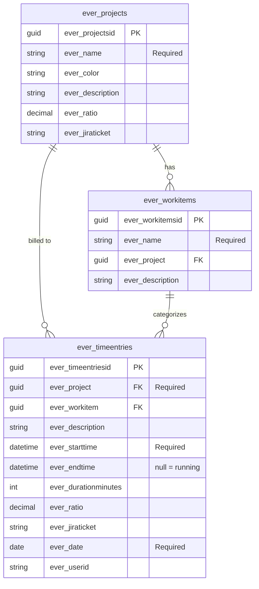

# TimeFlow — Power Apps Code App

A production-ready time tracking app built as a **Power Apps Code App** (React + TypeScript).
Tracks time against projects and tasks, stores data in Microsoft Dataverse, and includes a full reporting dashboard.

---

## Features

| Feature | Status |
|---|---|
| Timer (start / stop, Ctrl/Cmd + .) | ✅ |
| Project & task tagging | ✅ |
| Timesheet view (grouped by day, search + project filter) | ✅ |
| Manual entry creation (timesheet + calendar click-to-log) | ✅ |
| Week calendar (24h grid, overlap layout, running session) | ✅ |
| Reports dashboard (daily/weekly bar chart, project %, top tasks) | ✅ |
| KPI strip (total, avg per active day, sessions, projects) | ✅ |
| Projects management (create projects + tasks) | ✅ |
| Timer persists across page refresh | ✅ |
| Idle detection + 12h auto-stop safety net | ✅ |
| Delete with Undo | ✅ |
| CSV export (incl. Jira ticket + ratio) | ✅ |
| Dataverse backend wired (@microsoft/power-apps SDK) | ✅ |

---

## Local Development

### Prerequisites
- Node.js 18+
- npm or pnpm

### Run locally
```bash
npm install
npm run dev
```

The app runs with **mock data** in localStorage when `window.PowerApps` is not present.
Seed data (3 projects, tasks, 1 week of entries) is auto-generated on first run.

---

## Deploy to Power Apps

### Prerequisites
1. [Power Platform CLI](https://learn.microsoft.com/en-us/power-platform/developer/cli/introduction) installed
2. A Power Apps environment with a Dataverse database
3. Power Apps license (per-user or per-app)

### Step 1 — Authenticate
```bash
pac auth create --url https://YOUR_ORG.crm.dynamics.com
```

### Step 2 — Create Dataverse tables

The app expects these tables (logical names singular, entity-set names get the
`-es` pluralization, e.g. `ever_projects` → `ever_projectses`):

**Table: ever_projects**

| Column | Type | Notes |
|---|---|---|
| ever_name | Text | Required |
| ever_color | Text | Hex color e.g. #719500 |
| ever_description | Text (multiline) | Optional |
| ever_ratio | Decimal | Optional — default ratio for new entries |
| ever_jiraticket | Text | Optional |

**Table: ever_workitems** (tasks)

| Column | Type | Notes |
|---|---|---|
| ever_name | Text | Required |
| ever_project | Lookup → ever_projects | Required |
| ever_description | Text | Optional |

**Table: ever_timeentries**

| Column | Type | Notes |
|---|---|---|
| ever_project | Lookup → ever_projects | Required |
| ever_workitem | Lookup → ever_workitems | Optional |
| ever_description | Text | Optional |
| ever_starttime | DateTime | Required |
| ever_endtime | DateTime | Optional (null = running) |
| ever_durationminutes | Whole Number | Optional |
| ever_ratio | Decimal | Optional |
| ever_jiraticket | Text | Optional |
| ever_date | Date Only | Required |
| ever_userid | Text | Stamped with the Entra ID object id on write |

Active/inactive state uses the standard Dataverse `statecode` column.

> **Row security matters.** The app does NOT filter entries by `ever_userid`
> on reads (the SDK has returned inconsistent user ids across sessions).
> Per-user data isolation relies on Dataverse **owner-based row security** —
> make sure the `ever_timeentries` table is configured with user-level
> ownership and user-scope read privileges, or every user will see all rows.

#### Dataverse Security Configuration

Correct table-level security role configuration is required to keep each user's time entries private.

| Table | Ownership scope | Required privileges |
|---|---|---|
| `ever_timeentries` | **User** | Basic (Create / Read / Write / Delete) |
| `ever_projects` | Organization | Basic (Create / Read / Write / Delete) |
| `ever_workitems` | Organization | Basic (Create / Read / Write / Delete) |

**Why this matters:** Without user-scope ownership on `ever_timeentries`, every user can read every other user's time entries. There is no application-layer fallback.

**How to verify in the maker portal:**
1. Go to [make.powerapps.com](https://make.powerapps.com) → **Tables** → select `ever_timeentries`.
2. Open **Settings** → **Advanced options** → confirm *Ownership* is set to **User or Team**.
3. In your Security Role, confirm the `ever_timeentries` row is set to **User** scope for Read/Write/Create/Delete.
4. Repeat for `ever_projects` and `ever_workitems` (Organization scope for shared data is correct).

**Runtime detection (UAT sign-off check):** the app cannot fix a misconfigured
security role from the client, but it does detect one. On the first entries
refresh, `useTimeEntries` calls `hasForeignUserEntries()` to check whether any
returned row belongs to someone other than the signed-in user. If it ever
does, the UI shows a "Data isolation warning" toast and logs detail to the
console — that's a clear signal during UAT that step 2/3 above need to be
revisited before going to production. The check only runs once per page
load (a guard flag skips it on later refreshes) so the toast doesn't repeat
on every poll. Seeing this warning during a UAT session with two or more
test accounts is the practical way to confirm isolation is (or isn't)
actually enforced, since it can't be verified from the app code alone.

#### Entity Relationship Diagram



### Step 3 — (Optional) Point at a different environment

`src/services/dataverseService.ts` talks to Dataverse through the
`@microsoft/power-apps` SDK code generated in `src/generated/`. The org URL
defaults to the dev environment and can be overridden with
`VITE_DATAVERSE_ORG_URL` in a `.env` file.

Lookup writes use the `@odata.bind` form with entity-set paths
(`ever_project@odata.bind: /ever_projectses(<guid>)`); reads surface lookups
as `_ever_project_value`. The mapping lives in the `mapXxx` /
`xxxToDataverse` helpers — the rest of the app does not depend on those
details.

User identity is resolved by `src/services/userService.ts` via the SDK's
`getContext()`, with a persistent local-dev fallback for `npm run dev`.

### Step 4 — Build and push
```bash
npm run build
pac code push
```

### Step 5 — Run in Power Apps
```bash
pac code run
```

Or open Power Apps Studio and the app will appear in your environment.

---

## Project Structure

```
src/
  types/
    index.ts              — TypeScript interfaces for all data models
    powerapps.d.ts        — window.PowerApps runtime type declarations
  services/
    dataverseService.ts   — Real Dataverse calls + localStorage mock fallback
    userService.ts        — Current user (PowerApps userInfo / Office365Users / local)
    csvExport.ts          — CSV export helper
  hooks/index.ts          — React hooks: useProjects, useTasks, useTimeEntries, useTimer
  components/
    TimerBar.tsx          — Sticky timer bar at the top
    TimesheetPage.tsx     — Day-grouped list of time entries
    CalendarPage.tsx      — Week calendar with drag-to-create entries
    ReportsPage.tsx       — Dashboard with charts and KPIs
    ProjectsPage.tsx      — Project/task management
  App.tsx                 — Root layout, sign-in bootstrap, page routing
  styles.css              — Full dark theme CSS (no external UI library needed)
  main.tsx                — React entry point
```

---

## Customisation Tips

- **Colors**: Edit CSS variables in `styles.css` under `:root` to change the theme.
- **Adding fields**: Add columns to your Dataverse tables and update the TypeScript types + service layer.
- **Auth**: Power Apps Code Apps use Zero-config Microsoft Entra ID auth — no extra setup needed.
- **Sharing**: Deploy to your Power Apps environment and share with users as you would any Power App.
- **Power Automate**: Add approval flows or Teams notifications by connecting Power Automate to the `ever_timeentries` table on create/update triggers.

---

## License
MIT
