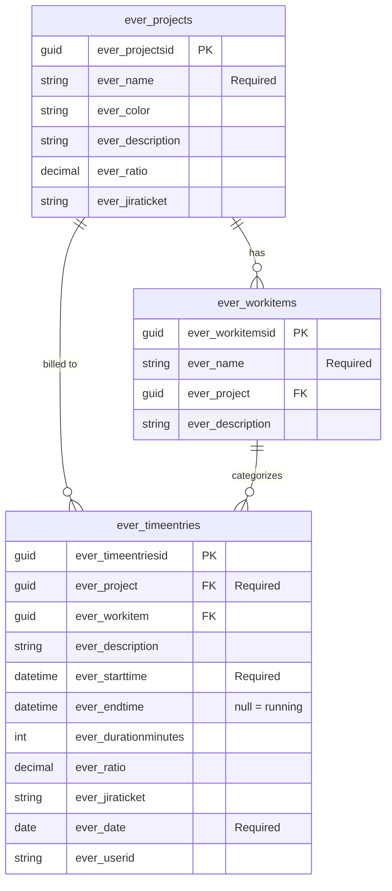

# TimeFlow — Power Apps Code App

A production-ready time tracking app built as a **Power Apps Code App** (React + TypeScript).
Tracks time against projects and tasks, stores data in Microsoft Dataverse, and includes a full reporting dashboard.

---

## Features

| Feature | Status |
|---|---|
| Timer (start / stop, Ctrl/Cmd + .) | ✅ |
| Project & task tagging | ✅ |
| Timesheet view (grouped by day, search + project filter) | ✅ |
| Manual entry creation (timesheet + calendar click-to-log) | ✅ |
| Week calendar (24h grid, overlap layout, running session) | ✅ |
| Calendar drag-to-reschedule + drag-to-resize (Shift + arrows by keyboard) | ✅ |
| Reports dashboard (daily/weekly bar chart, project %, top tasks) | ✅ |
| KPI strip (total, avg per active day, sessions, projects) | ✅ |
| Projects management (create, edit, archive/restore) | ✅ |
| Tasks (create, rename, delete with undo) | ✅ |
| Continue a past entry (one-click timer restart) | ✅ |
| Weekly target with progress (calendar + timesheet) | ✅ |
| Timer persists across page refresh | ✅ |
| Multi-tab timer sync | ✅ |
| Idle detection + 12h auto-stop safety net | ✅ |
| Delete with Undo | ✅ |
| CSV export (incl. Jira ticket + ratio, billing-style rounding) | ✅ |
| Reports: project × period matrix, all-time range | ✅ |
| Light + dark theme | ✅ |
| Dataverse backend wired (@microsoft/power-apps SDK) | ✅ |
| Outlook meeting overlay + log-from-meeting (Office 365 connector) | ✅ (needs [connector setup](#outlook-calendar-overlay)) |
| Manager Team view — reports' week totals, missing-day flags, project rollup | ✅ (needs [hierarchy security](#manager-team-view-hierarchy-security)) |
| Focus mode (Pomodoro) — focus/break cadence on the timer, daily block count | ✅ |

---

## Local Development

### Prerequisites
- Node.js 18+
- npm or pnpm
- **Linux only:** `libsecret-1-dev` (`sudo apt install libsecret-1-dev` on Debian/Ubuntu). It's pulled in natively by `@microsoft/power-apps` → `@azure/msal-node-extensions` → `keytar`. GitHub-hosted CI runners have it preinstalled; a fresh Linux box doesn't, and `npm install`/`npm ci` fails with a cryptic `node-gyp` build error without it.

### Run locally
```bash
npm install
npm run dev
```

### Checks
```bash
npm run lint          # ESLint (flat config, react-hooks rules) — warnings fail
npm run typecheck     # tsc --noEmit
npm test              # vitest, single run
npm run test:coverage # same, with a coverage report (text + html + lcov)
```

CI runs all four plus `npm run build` on every push to `main` and every pull
request. `npx vitest` (no `run`) starts the watcher for local development.

The app runs with **mock data** in localStorage when `window.PowerApps` is not present.
There is no seed data — a fresh `npm run dev` starts with an empty workspace; create your first project from the Projects page.

---

## Deploy to Power Apps

### Prerequisites
1. [Power Platform CLI](https://learn.microsoft.com/en-us/power-platform/developer/cli/introduction) installed
2. A Power Apps environment with a Dataverse database
3. Power Apps license (per-user or per-app)

### Step 1 — Authenticate
```bash
pac auth create --url https://YOUR_ORG.crm.dynamics.com
```

### Step 2 — Create Dataverse tables

The app expects these tables (logical names singular, entity-set names get the
`-es` pluralization, e.g. `ever_projects` → `ever_projectses`):

**Table: ever_projects**

| Column | Type | Notes |
|---|---|---|
| ever_name | Text | Required |
| ever_color | Text | Hex color e.g. #719500 |
| ever_description | Text (multiline) | Optional |
| ever_ratio | Decimal | Optional — default ratio for new entries |
| ever_jiraticket | Text | Optional |

**Table: ever_workitems** (tasks)

| Column | Type | Notes |
|---|---|---|
| ever_name | Text | Required |
| ever_project | Lookup → ever_projects | Required |
| ever_description | Text | Optional |

**Table: ever_timeentries**

| Column | Type | Notes |
|---|---|---|
| ever_project | Lookup → ever_projects | Required |
| ever_workitem | Lookup → ever_workitems | Optional |
| ever_description | Text | Optional |
| ever_starttime | DateTime | Required |
| ever_endtime | DateTime | Optional (null = running) |
| ever_durationminutes | Whole Number | Optional |
| ever_ratio | Decimal | Optional |
| ever_jiraticket | Text | Optional |
| ever_date | Date Only | Required |
| ever_userid | Text | Stamped with the Entra ID object id on write |

Active/inactive state uses the standard Dataverse `statecode` column.
Deleting a task or archiving a project in the app **deactivates** the record
(`statecode` = Inactive) rather than deleting the row — a hard delete would
null the lookup on historical time entries and silently strip names from past
reports and exports. Undo/Restore reactivates the same record. Time entries
are the only records the app hard-deletes.

User preferences live in `localStorage` — Code Apps have no per-user settings
store, and this keeps the app free of extra Dataverse tables. Weekly target
hours, export rounding, focus-mode settings/session counts, the Outlook
overlay toggle and its logged-meeting checkmarks are scoped per environment +
user; the theme is a device/browser preference stored under a flat `tt_theme`
key so it applies before sign-in resolves (see `useTheme`).

**Focus mode (Pomodoro):** the "Focus" chip in the timer bar layers a
prescriptive cadence on the descriptive timer — after each focus block
(default 25m, editable via the pencil) a prompt offers a break or keep-going;
taking the break stops and saves the entry, counts the block, and counts the
break down in the chip, then offers to restart the timer on the same work.
Prompts only fire while the app tab is open — a Code App has no OS-level
presence for background notifications.

> **Row security matters.** Reads filter server-side via FetchXML's
> `eq-userid` operator (Dataverse resolves this to "the calling user" itself,
> so it doesn't depend on comparing stored ids from the client — the SDK has
> returned inconsistent user ids across sessions for the `ever_userid`
> column, which is why that column is stamped for display/audit purposes but
> not used to filter). This still relies on `ever_timeentries` having
> **user-level ownership** configured — `eq-userid` filters against
> `ownerid`, which only has per-user meaning under that ownership scope. Make
> sure the table is configured accordingly, or every user will see all rows.

#### Dataverse Security Configuration

Correct table-level security role configuration is required to keep each user's time entries private.

| Table | Ownership scope | Required privileges |
|---|---|---|
| `ever_timeentries` | **User** | Basic (Create / Read / Write / Delete) |
| `ever_projects` | Organization | Basic (Create / Read / Write / Delete) |
| `ever_workitems` | Organization | Basic (Create / Read / Write / Delete) |

**Why this matters:** Without user-scope ownership on `ever_timeentries`, the app's `eq-userid` read filter (see "Row security matters" above) has no per-user `ownerid` to match against, and every user can read every other user's time entries.

**How to verify in the maker portal:**
1. Go to [make.powerapps.com](https://make.powerapps.com) → **Tables** → select `ever_timeentries`.
2. Open **Settings** → **Advanced options** → confirm *Ownership* is set to **User or Team**.
3. In your Security Role, confirm the `ever_timeentries` row is set to **User** scope for Read/Write/Create/Delete.
4. Repeat for `ever_projects` and `ever_workitems` (Organization scope for shared data is correct).

#### Manager Team view (hierarchy security)

The **Team** page (issue #61) shows a manager their direct reports' week —
per-member day/week totals, missing-weekday flags, and a project rollup. It
is built on Dataverse **Hierarchy security (Manager hierarchy)**, not on a
loosened read filter, so the per-user isolation above is untouched:

- The nav item only appears for users who have direct reports (the app probes
  `systemuser.parentsystemuserid`; requires org-level Read on the User table,
  which baseline roles typically grant).
- The Team page reads with FetchXML's `eq-useroruserhierarchy` operator,
  which Dataverse resolves server-side to "the calling user and their
  reports". A non-manager who somehow reached the page would get only their
  own rows back — the client never widens anything.
- The personal pages still read with `eq-userid`, and their
  `hasForeignUserEntries()` isolation check stays armed unchanged (the Team
  page's cross-user rows never flow through `useTimeEntries`).

Environment setup (details in `Brandon To Do.md`): set the **Manager** field
on each Power Apps user profile — that field (`parentsystemuserid`) is the
only thing the app reads; the M365/Entra org chart is not consulted and does
not sync into it. Then enable **Hierarchy security** with the Manager
hierarchy and include `ever_timeentries` in its table list. In local dev,
preview the page with `localStorage.setItem("tt_mock_team", "1")`.

**Runtime detection (UAT sign-off check):** as defense in depth, on the first
entries refresh `useTimeEntries` calls `hasForeignUserEntries()` to check
whether any returned row belongs to someone other than the signed-in user.
This should never trip given the `eq-userid` read filter above, but if it
ever does, the UI shows a "Data isolation warning" toast and logs detail to
the console — a signal that something is seriously wrong (e.g. an
unexpected Dataverse behavior) and step 2/3 above need to be revisited
before going to production. The check only runs once per page load (a guard
flag skips it on later refreshes) so the toast doesn't repeat on every poll.

#### Entity Relationship Diagram


```mermaid
erDiagram
    ever_projects {
        guid ever_projectsid PK
        string ever_name "Required"
        string ever_color
        string ever_description
        decimal ever_ratio
        string ever_jiraticket
    }
    ever_workitems {
        guid ever_workitemsid PK
        string ever_name "Required"
        guid ever_project FK
        string ever_description
    }
    ever_timeentries {
        guid ever_timeentriesid PK
        guid ever_project FK "Required"
        guid ever_workitem FK
        string ever_description
        datetime ever_starttime "Required"
        datetime ever_endtime "null = running"
        int ever_durationminutes
        decimal ever_ratio
        string ever_jiraticket
        date ever_date "Required"
        string ever_userid
    }
    ever_projects ||--o{ ever_workitems : "has"
    ever_projects ||--o{ ever_timeentries : "billed to"
    ever_workitems ||--o{ ever_timeentries : "categorizes"
```

### Step 3 — Environment targeting

`src/services/dataverseService.ts` talks to Dataverse through the
`@microsoft/power-apps` SDK code generated in `src/generated/`. Every
`*WithOrganization` call passes the connector's `"current"` token instead of
a baked-in org URL, so there is nothing to configure — a single build
artifact targets whichever environment it's deployed into (dev, QA, or
prod) automatically. There is no `VITE_DATAVERSE_ORG_URL` (or any other org
URL) setting; see `.env.example`.

Lookup writes use the `@odata.bind` form with entity-set paths
(`ever_project@odata.bind: /ever_projectses(<guid>)`); reads surface lookups
as `_ever_project_value`. The mapping lives in the `mapXxx` /
`xxxToDataverse` helpers — the rest of the app does not depend on those
details.

Updates go through `UpdateOnlyRecordWithOrganization` (If-Match `*`), never
the connector's `UpdateRecordWithOrganization`, which is an *upsert*: saving
an edit to a row someone else deleted must fail with a 404 the caller can
handle, not silently recreate the row from the patch. Reads and writes are
both wrapped in the same 429/503 backoff, and `getOpenTimerEntry()` throws
rather than reporting "no open timer" when it can't reach Dataverse — the
timer bootstrap treats that as "unknown" and keeps local state.

User identity is resolved by `src/services/userService.ts` via the SDK's
`getContext()`, with a persistent local-dev fallback for `npm run dev`.

### Outlook calendar overlay

The Calendar page can pull the signed-in user's Outlook meetings in as muted
"ghost" blocks behind their tracked time; clicking a meeting opens Log Time
prefilled with the meeting's span and subject, so categorizing a meeting into
a project takes two clicks. Each user sees only their own calendar: the
Office 365 Outlook connector runs on a per-user delegated connection that
every user consents to on first launch.

The connector is **optional and off until an admin wires it up** — without it
the page shows an "Outlook: not connected" chip and everything else works
normally. To enable it:

1. Add the data source (once, from a dev machine authenticated with `pac`):
   ```bash
   pac connection list                     # find/create an Office 365 Outlook connection id
   pac code add-data-source -a shared_office365 -c <connectionId>
   ```
   This regenerates `.power/schemas/appschemas/dataSourcesInfo` with an
   `office365` entry and registers the connection reference in
   `power.config.json`. Until that file carries an `office365` entry, the app
   uses its own fallback operation schemas for the two calls it makes
   (`CalendarGetTables_V2`, `GetEventsCalendarViewV3`) — see
   `src/services/outlookService.ts`.
2. Check the environment's **DLP policy**: Office 365 Outlook must sit in the
   same data group as Microsoft Dataverse, or the platform will refuse to run
   the app with both connectors. This is the most common "worked in dev,
   blocked in prod" failure.
3. `npm run build && pac code push`. Users get a one-time consent prompt for
   the new connection on next launch.

Details and caveats:
- **All-day events are not shown** — they have no time span to lay out on the
  hour grid (and logging one needs real times anyway).
- Meetings that cross midnight are clamped to the day they start on, exactly
  like entry blocks.
- The "already logged" checkmark on a meeting is tracked in `localStorage`
  per environment + user (there is no Dataverse column linking an entry to
  its source meeting), so it's per-device: a meeting logged on one machine
  shows unchecked on another. The time entries themselves are the record.
- In local dev (`npm run dev`), deterministic mock meetings are served so the
  overlay is demoable without Microsoft 365.

### Step 4 — Build and push
```bash
npm run build
pac code push
```

### Step 5 — Run in Power Apps
```bash
pac code run
```

Or open Power Apps Studio and the app will appear in your environment.

---

## Project Structure

Tests live next to what they cover, as `*.test.ts(x)`.

```
src/
  types/
    index.ts              — TypeScript interfaces for all data models
    powerapps.d.ts        — window.PowerApps runtime type declarations
  generated/              — Power Platform SDK client (generated; not linted)
  services/
    dataverseService.ts   — Real Dataverse calls + localStorage mock fallback
    userService.ts        — Current user (PowerApps userInfo / Office365Users / local)
    csvExport.ts          — CSV export helper (rounding, escaping, BOM)
  contexts/
    DataRangeContext.tsx  — Which date range the pages currently need loaded
    ToastContext.tsx      — Toast notifications with undo
  hooks/index.ts          — React hooks: useProjects, useTasks, useTimeEntries, useTimer,
                            useTimerSafety, useTheme, useToday, useWeeklyTarget, useFocusTrap
  utils/
    dates.ts              — Local-timezone date helpers (never toISOString for dates)
    calendarGeometry.ts   — Calendar pointer maths (slots, snapping, day columns)
    reportAggregations.ts — Pure aggregation behind the Reports dashboard
  components/
    TimerBar.tsx          — Sticky timer bar at the top
    OverviewPage.tsx      — Landing page with the activity heatmap
    TimesheetPage.tsx     — Day-grouped list of time entries
    CalendarPage.tsx      — Week calendar: drag to create, resize, reschedule
    ReportsPage.tsx       — Dashboard with charts and KPIs
    ProjectsPage.tsx      — Project/task management
  App.tsx                 — Root layout, sign-in bootstrap, page routing
  styles.css              — Full theme CSS, light + dark (no external UI library needed)
  main.tsx                — React entry point
```

---

## Customisation Tips

- **Colors**: Edit CSS variables in `styles.css` under `:root` to change the theme.
- **Adding fields**: Add columns to your Dataverse tables and update the TypeScript types + service layer.
- **Auth**: Power Apps Code Apps use Zero-config Microsoft Entra ID auth — no extra setup needed.
- **Sharing**: Deploy to your Power Apps environment and share with users as you would any Power App.
- **Power Automate**: Add approval flows or Teams notifications by connecting Power Automate to the `ever_timeentries` table on create/update triggers.

---

## License
MIT — see [LICENSE](LICENSE).
