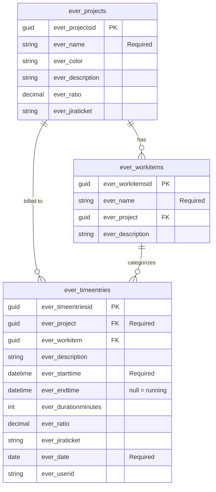

# TimeFlow — Power Apps Code App

A production-ready time tracking app built as a **Power Apps Code App** (React + TypeScript).
Tracks time against projects and tasks, stores data in Microsoft Dataverse, and includes a full reporting dashboard.

---

## Features

| Feature | Status |
|---|---|
| Timer screen — running clock, the day as a bar, the week as a ring | ✅ |
| Timer (start / stop, Ctrl/Cmd + . from anywhere in the app) | ✅ |
| Stop sheet — confirm, correct and file the entry the stop just wrote | ✅ |
| Project & task tagging | ✅ |
| Timesheet view (grouped by day, with untracked gaps as rows) | ✅ |
| Manual entry creation (drag the day bar, drag the calendar, or Log time) | ✅ |
| Week calendar (24h grid, overlap layout, running session) | ✅ |
| Calendar drag-to-reschedule + drag-to-resize (Shift + arrows by keyboard) | ✅ |
| Untracked-gap detection (calendar, timesheet and day bar; one click to fill) | ✅ ([working hours are per user](#untracked-gap-detection)) |
| Reports (daily bars with an average line, project shares, top tasks) | ✅ |
| Projects management (create, edit, archive/restore) with tasks nested inline | ✅ |
| Tasks (create, delete with undo) | ✅ |
| Continue a past entry (one-click timer restart from the timer screen) | ✅ |
| Weekly target with progress, and a sentence about pace | ✅ |
| Timer persists across page refresh | ✅ |
| Multi-tab timer sync | ✅ |
| Idle detection + 12h auto-stop safety net | ✅ ([client-side only](#the-12h-auto-stop-is-client-side)) |
| Delete with Undo | ✅ |
| CSV export (incl. Jira ticket + ratio, billing-style rounding) | ✅ |
| Light + dark theme | ✅ |
| Dataverse backend wired (@microsoft/power-apps SDK) | ✅ |
| Outlook meeting overlay + log-from-meeting, with per-subject muting | ✅ (connector wired; needs [DLP + consent](#outlook-calendar-overlay)) |
| Manager Team view — direct/whole-line scope, missing-day flags, CSV export | ✅ (needs [hierarchy security](#manager-team-view-hierarchy-security)) |

The **Timer** screen is the default landing page (`App.tsx`). Navigation is five
items, six for managers.

### Deliberately not here

Each of these shipped once and was taken out in the 2026-09 redesign, so
re-adding one is a decision rather than an oversight:

| Removed | Why |
|---|---|
| **Overview page** | Its content is the lower half of the timer screen. Two landing pages is one too many. |
| **Focus mode (Pomodoro)** | A second, prescriptive clock competing with the descriptive one, whose prompts die with the tab. |
| **Activity heatmap** | Twelve weeks of 3px squares is not a readable shape, and it answered a question nobody asked. |
| **Day-streak KPI** | Gamified compliance in a billing app. |
| **The KPI strips** | Today, This week and the target ring said the same thing three ways. One ring and one sentence replace them. |
| **Ratio + ticket in the timer bar** | Optional on most entries; they live on the stop sheet, inherited from the project. |
| **Inline "+ New task…" before starting** | Naming work before doing it produces bad names. Task creation moved to the stop sheet. |

---

## Documentation

| Doc | What's in it |
|---|---|
| [CONTRIBUTING.md](CONTRIBUTING.md) | Setup, the four checks, test/commit conventions, how a release is cut |
| [docs/RUNBOOK.md](docs/RUNBOOK.md) | Deploy, rollback, Dataverse backup/restore, first-line support triage, the environment admin checklist |
| [docs/DECISIONS.md](docs/DECISIONS.md) | Settled decisions and their reasoning; open decisions with an owner and a date |
| [CHANGELOG.md](CHANGELOG.md) | What shipped, per version |
| [docs/design/2026-09-redesign-handoff.md](docs/design/2026-09-redesign-handoff.md) | The brief the 2026-09 redesign was built from: tokens, type scale, every screen, and what was removed — plus where the implementation deviates and why |
| [docs/reviews/](docs/reviews/) | The 2026-08-12 six-discipline application review, and the reconstructed July design-review register |
| [CLAUDE.md](CLAUDE.md) | Orientation for coding agents: commands, the date rule, the mock-vs-host split |

---

## Behaviour worth knowing before you support this app

### The 12h auto-stop is client-side

A timer running past 12 hours is stopped automatically — but the check is a
`setInterval` in the browser (`useTimerSafety.ts`), not a server-side job. Close
the tab on a running timer and **nothing stops it**; the running entry is
reconciled from the server draft the next time the app launches, and the user
fixes the end time on the Timesheet. A Code App has no presence when its tab is
gone.

When the cap does fire while the tab is open, it stops and saves at exactly 12h
00m and raises a sheet saying so, with one action that opens the entry at the
end time it should have had. It is deliberately not a toast: a message that
reports something the user did not ask for *and* needs an answer is not a toast.

### Untracked-gap detection

The Calendar, the Timesheet and every day bar surface stretches of the day
nothing was logged against, and offer each as one click to fill. The rules live
in one place (`src/utils/gaps.ts`) so no two surfaces can disagree:

- **Working hours and the minimum gap are per user**, set from the sidebar and
  stored in `localStorage` alongside the weekly target (`useWorkingHours.ts`).
  They default to 08:00–18:00 and "longer than 15 minutes". They used to be
  hardcoded, which was a correctness bug rather than a preference: anyone on a
  different shift was told their day was complete while hours of it sat outside
  the search window.
- A stored window that ends at or before it starts is rejected on read — an
  inverted window makes every day gapless, which is the exact failure the
  setting exists to prevent.
- Today is capped at the current minute; future days are skipped entirely.
- A day with no entries at all reports nothing, so weekends don't each show a
  ten-hour gap.

---

## Local Development

### Prerequisites
- Node.js 20.19+ or 22.12+ (Vite 7's floor). Enforced by `engines` in
  `package.json`; the exact version CI uses is in `.nvmrc` (`nvm use` picks it
  up, and the CI workflow reads the same file)
- npm or pnpm
- **Linux only:** `libsecret-1-dev` (`sudo apt install libsecret-1-dev` on Debian/Ubuntu). It's pulled in natively by `@microsoft/power-apps` → `@azure/msal-node-extensions` → `keytar`. GitHub-hosted CI runners have it preinstalled; a fresh Linux box doesn't, and `npm install`/`npm ci` fails with a cryptic `node-gyp` build error without it.

### Run locally
```bash
npm install
npm run dev
```

### Checks
```bash
npm run lint          # ESLint (flat config, react-hooks rules) — warnings fail
npm run typecheck     # tsc --noEmit
npm test              # vitest, single run
npm run test:coverage # same, with a coverage report (text + html + lcov)
```

CI runs all four plus `npm run build` on every push to `main` and every pull
request. `npx vitest` (no `run`) starts the watcher for local development.

The app runs with **mock data** in localStorage when `window.PowerApps` is not present.
There is no seed data — a fresh `npm run dev` starts with an empty workspace; create your first project from the Projects page.

Conventions, test practices and the commit/PR rules are in
[CONTRIBUTING.md](CONTRIBUTING.md).

---

## Deploy to Power Apps

Set-up instructions are below; the operational side — cutting a release,
rolling one back, backup/restore, and what to check when a user reports a
problem — is in [docs/RUNBOOK.md](docs/RUNBOOK.md).

### Prerequisites
1. [Power Platform CLI](https://learn.microsoft.com/en-us/power-platform/developer/cli/introduction) installed
2. A Power Apps environment with a Dataverse database
3. Power Apps license (per-user or per-app)

### Step 1 — Authenticate
```bash
pac auth create --url https://YOUR_ORG.crm.dynamics.com
```

### Step 2 — Create Dataverse tables

The app expects these tables (logical names singular, entity-set names get the
`-es` pluralization, e.g. `ever_projects` → `ever_projectses`):

**Table: ever_projects**

| Column | Type | Notes |
|---|---|---|
| ever_name | Text | Required |
| ever_color | Text | Hex color e.g. #719500 |
| ever_description | Text (multiline) | Optional |
| ever_ratio | Decimal | Optional — default ratio for new entries |
| ever_jiraticket | Text | Optional |

**Table: ever_workitems** (tasks)

| Column | Type | Notes |
|---|---|---|
| ever_name | Text | Required |
| ever_project | Lookup → ever_projects | Required |
| ever_description | Text | Optional |

**Table: ever_timeentries**

| Column | Type | Notes |
|---|---|---|
| ever_project | Lookup → ever_projects | Required |
| ever_workitem | Lookup → ever_workitems | Optional |
| ever_description | Text | Optional |
| ever_starttime | DateTime | Required |
| ever_endtime | DateTime | Optional (null = running) |
| ever_durationminutes | Whole Number | Optional |
| ever_ratio | Decimal | Optional |
| ever_jiraticket | Text | Optional |
| ever_date | Date Only | Required |
| ever_userid | Text | Stamped with the Entra ID object id on write |

Active/inactive state uses the standard Dataverse `statecode` column.
Deleting a task or archiving a project in the app **deactivates** the record
(`statecode` = Inactive) rather than deleting the row — a hard delete would
null the lookup on historical time entries and silently strip names from past
reports and exports. Undo/Restore reactivates the same record. Time entries
are the only records the app hard-deletes.

User preferences live in `localStorage` — Code Apps have no per-user settings
store, and this keeps the app free of extra Dataverse tables. Weekly target
hours, working hours, export rounding, the Outlook overlay toggle and its
logged-meeting checkmarks are scoped per environment + user; the theme is a
device/browser preference stored under a flat `tt_theme` key so it applies
before sign-in resolves (see `useTheme`).

> **Row security matters.** Reads filter server-side via FetchXML's
> `eq-userid` operator (Dataverse resolves this to "the calling user" itself,
> so it doesn't depend on comparing stored ids from the client — the SDK has
> returned inconsistent user ids across sessions for the `ever_userid`
> column, which is why that column is stamped for display/audit purposes but
> not used to filter). This still relies on `ever_timeentries` having
> **user-level ownership** configured — `eq-userid` filters against
> `ownerid`, which only has per-user meaning under that ownership scope. Make
> sure the table is configured accordingly, or every user will see all rows.

#### Dataverse Security Configuration

Correct table-level security role configuration is required to keep each user's time entries private.

| Table | Ownership scope | Required privileges |
|---|---|---|
| `ever_timeentries` | **User** | Basic (Create / Read / Write / Delete) |
| `ever_projects` | Organization | Basic (Create / Read / Write / Delete) |
| `ever_workitems` | Organization | Basic (Create / Read / Write / Delete) |

> **This table is a release gate, not a setup note.** Re-verify it after **every
> solution import into every environment** — an import can bring a security role
> that replaces the one you checked last time, and nothing in the app will say
> so. The sign-off procedure, including the two-account UAT and the unfiltered
> devtools read that tests the boundary itself rather than the app's own
> filtering, is [docs/UAT-DATA-ISOLATION.md](docs/UAT-DATA-ISOLATION.md)
> ([#91](https://github.com/TheShield2594/timeflow/issues/91)). A deploy without
> a filled-in checklist has not verified isolation; it has assumed it.

**Why this matters:** Without user-scope ownership on `ever_timeentries`, the app's `eq-userid` read filter (see "Row security matters" above) has no per-user `ownerid` to match against, and every user can read every other user's time entries.

**How to verify in the maker portal:**
1. Go to [make.powerapps.com](https://make.powerapps.com) → **Tables** → select `ever_timeentries`.
2. Open **Settings** → **Advanced options** → confirm *Ownership* is set to **User or Team**.
3. In your Security Role, confirm the `ever_timeentries` row is set to **User** scope for Read/Write/Create/Delete.
4. Repeat for `ever_projects` and `ever_workitems` (Organization scope for shared data is correct — tasks are a shared per-project vocabulary by decision, not by accident; see [D-1 in docs/DECISIONS.md](docs/DECISIONS.md#tasks-are-shared-per-project-deliberately-2026-08-26)).
5. Run [the data-isolation UAT checklist](docs/UAT-DATA-ISOLATION.md) with two real accounts. Steps 1–4 confirm the *settings*; that checklist confirms the *behaviour*, which is the thing that actually protects the data.

#### Manager Team view (hierarchy security)

The **Team** page (issue #61) shows a manager their direct reports' week —
per-member day/week totals, missing-weekday flags, and a project rollup. It
is built on Dataverse **Hierarchy security (Manager hierarchy)**, not on a
loosened read filter, so the per-user isolation above is untouched:

- The nav item only appears for users who have direct reports (the app probes
  `systemuser.parentsystemuserid`; requires org-level Read on the User table,
  which baseline roles typically grant).
- The Team page reads with FetchXML's `eq-useroruserhierarchy` operator,
  which Dataverse resolves server-side to "the calling user and their
  reports". A non-manager who somehow reached the page would get only their
  own rows back — the client never widens anything.
- The personal pages still read with `eq-userid`, and their
  `hasForeignUserEntries()` isolation check stays armed unchanged (the Team
  page's cross-user rows never flow through `useTimeEntries`).

Environment setup (full checklist in
[the runbook](docs/RUNBOOK.md#6-admin-setup-checklist), tracked in
[#130](https://github.com/TheShield2594/timeflow/issues/130)): set the
**Manager** field on each Power Apps user profile — that field
(`parentsystemuserid`) is the only thing the app reads; the M365/Entra org
chart is not consulted and does not sync into it, so every new hire needs it
set by hand or their manager silently loses visibility with no error
([#131](https://github.com/TheShield2594/timeflow/issues/131) — the recurring
joiner/mover/leaver list and an Entra reconciliation recipe are in
[runbook §7](docs/RUNBOOK.md#7-joiners-movers-and-leavers)). Then enable
**Hierarchy security** with the Manager hierarchy. Its table list is an
*exclusion* list — every table is included by default, so `ever_timeentries`
needs nothing done to it, and trimming the list is both unnecessary and a good
way to hit the change-set limit ([runbook §6](docs/RUNBOOK.md#6-admin-setup-checklist)). In local dev, preview the page with
`localStorage.setItem("tt_mock_team", "1")`.

**Runtime detection (defense in depth):** two checks watch for the boundary
having already failed. Neither is the boundary — see
[the UAT checklist](docs/UAT-DATA-ISOLATION.md) for that.

- **Personal path:** on the first entries refresh, `useTimeEntries` calls
  `hasForeignUserEntries()` to check whether any returned row belongs to someone
  other than the signed-in user. This should never trip given the `eq-userid`
  read filter above; if it does, the UI shows a "Data isolation warning" toast
  and the event is reported as `data_isolation_personal`. Something is seriously
  wrong and steps 2/3 above need revisiting before going to production.
- **Team path:** `findUnexpectedOwners()` flags any owner in a Team read who is
  neither the caller nor one of their direct reports, reported as
  `data_isolation_team` ([#91](https://github.com/TheShield2594/timeflow/issues/91)).
  It logs rather than alarms and shows the user nothing, because it has a benign
  expected cause: `eq-useroruserhierarchy` resolves to the caller's whole
  subtree, so a manager of managers legitimately sees rows owned by indirect
  reports, who aren't in the direct-reports probe. The counts in the report
  separate that from the dangerous cause — a couple of unexpected owners is the
  hierarchy; a large share of the result set is a misconfiguration.

Each fires once per session, scoped per environment + user, so a repeated
refresh doesn't repeat the signal.

#### Production telemetry

Every failure signal used to terminate in the affected user's browser — worst of
all the isolation canary above, which told the one person who couldn't act on it
and nobody else ([#111](https://github.com/TheShield2594/timeflow/issues/111)).
`src/services/telemetry.ts` is the one place a signal can leave: error-boundary
catches, both isolation checks, partial/truncated loads, and a failed bootstrap
task load.

Both sinks are optional and read at build time. With neither set the module is
console-only, which is what `npm run dev` wants and what an unconfigured
environment gets:

| Variable | Effect |
|---|---|
| `VITE_APPINSIGHTS_CONNECTION_STRING` | POSTs classic Track envelopes to that Application Insights resource. No SDK, so nothing extra ships in the bundle. |
| `VITE_TELEMETRY_ENDPOINT` | POSTs JSON to any URL — a Logic App, a Power Automate HTTP trigger. Used when there's no connection string. |

One resource can serve Dev, QA and Prod: every event carries `environmentId` and
`userId`. Events carry ids, counts and error messages only — never entry
descriptions, project or task names, Jira tickets or durations, since the
description field is the one users type prose into. Identical events collapse to
the first and a session stops sending past a cap, so a crash inside a render
loop is one report rather than thousands.

#### Entity Relationship Diagram


```mermaid
erDiagram
    ever_projects {
        guid ever_projectsid PK
        string ever_name "Required"
        string ever_color
        string ever_description
        decimal ever_ratio
        string ever_jiraticket
    }
    ever_workitems {
        guid ever_workitemsid PK
        string ever_name "Required"
        guid ever_project FK
        string ever_description
    }
    ever_timeentries {
        guid ever_timeentriesid PK
        guid ever_project FK "Required"
        guid ever_workitem FK
        string ever_description
        datetime ever_starttime "Required"
        datetime ever_endtime "null = running"
        int ever_durationminutes
        decimal ever_ratio
        string ever_jiraticket
        date ever_date "Required"
        string ever_userid
    }
    ever_projects ||--o{ ever_workitems : "has"
    ever_projects ||--o{ ever_timeentries : "billed to"
    ever_workitems ||--o{ ever_timeentries : "categorizes"
```

### Step 3 — Environment targeting

`src/services/dataverseService.ts` talks to Dataverse through the
`@microsoft/power-apps` SDK code generated in `src/generated/`. Every
`*WithOrganization` call passes the connector's `"current"` token instead of
a baked-in org URL, so there is nothing to configure — a single build
artifact targets whichever environment it's deployed into (dev, QA, or
prod) automatically. There is no `VITE_DATAVERSE_ORG_URL` (or any other org
URL) setting; see `.env.example`.

Lookup writes use the `@odata.bind` form with entity-set paths
(`ever_project@odata.bind: /ever_projectses(<guid>)`); reads surface lookups
as `_ever_project_value`. The mapping lives in the `mapXxx` /
`xxxToDataverse` helpers — the rest of the app does not depend on those
details.

Updates go through `UpdateOnlyRecordWithOrganization` (If-Match `*`), never
the connector's `UpdateRecordWithOrganization`, which is an *upsert*: saving
an edit to a row someone else deleted must fail with a 404 the caller can
handle, not silently recreate the row from the patch. Reads and writes are
both wrapped in the same 429/503 backoff, and `getOpenTimerEntry()` throws
rather than reporting "no open timer" when it can't reach Dataverse — the
timer bootstrap treats that as "unknown" and keeps local state.

User identity is resolved by `src/services/userService.ts` via the SDK's
`getContext()`, with a persistent local-dev fallback for `npm run dev`.

### Outlook calendar overlay

The Calendar page can pull the signed-in user's Outlook meetings in as muted
"ghost" blocks behind their tracked time; clicking a meeting opens Log Time
prefilled with the meeting's span and subject, so categorizing a meeting into
a project takes two clicks. Each user sees only their own calendar: the
Office 365 Outlook connector runs on a per-user delegated connection that
every user consents to on first launch.

The connector is **optional** — without it the page shows an "Outlook: not
connected" chip and everything else works normally.

**The data source is already added and committed.** `power.config.json` carries
the `shared_office365` connection reference and
`.power/schemas/appschemas/dataSourcesInfo` has the `office365` entry with both
operations, so step 1 below does *not* need doing again:

1. ~~Add the data source (once, from a dev machine authenticated with `pac`):~~
   **Done** — `pac connection list` then
   `pac code add-data-source -a shared_office365 -c <connectionId>`, in commit
   `1a721ed`. Kept here for reference and for any new environment that needs its
   own connection. Without an `office365` entry in `dataSourcesInfo`, the app
   falls back to its own operation schemas for the two calls it makes
   (`CalendarGetTables_V2`, `GetEventsCalendarViewV3`) — see
   `src/services/outlookService.ts`.
2. Check the environment's **DLP policy**: Office 365 Outlook must sit in the
   same data group as Microsoft Dataverse, or the platform will refuse to run
   the app with both connectors. This is the most common "worked in dev,
   blocked in prod" failure.
3. `npm run build && pac code push`. Users get a one-time consent prompt for
   the new connection on next launch.

Steps 2 and 3 are what actually remain — tracked in
[#130](https://github.com/TheShield2594/timeflow/issues/130), with the full
checklist in [the runbook](docs/RUNBOOK.md#6-admin-setup-checklist).

Details and caveats:
- **All-day events are not shown** — they have no time span to lay out on the
  hour grid (and logging one needs real times anyway).
- Meetings that cross midnight are clamped to the day they start on, exactly
  like entry blocks.
- The "already logged" checkmark on a meeting is tracked in `localStorage`
  per environment + user (there is no Dataverse column linking an entry to
  its source meeting), so it's per-device: a meeting logged on one machine
  shows unchecked on another. The time entries themselves are the record.
- In local dev (`npm run dev`), deterministic mock meetings are served so the
  overlay is demoable without Microsoft 365.

### Step 4 — Build and push
```bash
npm run build
pac code push
```

### Step 5 — Run in Power Apps
```bash
pac code run
```

Or open Power Apps Studio and the app will appear in your environment.

---

## Project Structure

Tests live next to what they cover, as `*.test.ts(x)`.

```
src/
  types/
    index.ts               — TypeScript interfaces for all data models
    powerapps.d.ts         — window.PowerApps runtime type declarations
  generated/               — Power Platform SDK client (generated; not linted)
  services/                — the only modules that talk to the SDK
    dataverseService.ts    — Real Dataverse calls + localStorage mock fallback
    outlookService.ts      — Office 365 Outlook calendar reads (+ mock meetings)
    teamService.ts         — Direct-report detection and the Team page's reads
    userService.ts         — Current user; decides host-vs-mock for everything
    csvExport.ts           — CSV export helper (rounding, escaping, BOM)
  contexts/
    DataContext.tsx        — Entries/projects/tasks + the mutations over them
    DataRangeContext.tsx   — Which date range the pages currently need loaded
    ToastContext.tsx       — Toast notifications with undo
  hooks/                   — one hook per file; index.ts re-exports the main four
    useAppBootstrap.ts     — Sign-in resolution and auth error state
    useProjects.ts         — Projects, optimistic create/edit/archive/restore
    useTasks.ts            — Tasks, with per-project lazy loading
    useTimeEntries.ts      — Entries for the loaded range + the isolation check
    useTimer.ts            — Running timer: persistence, multi-tab sync, drafts
    useTimerSafety.ts      — Activity tracking, idle detection, 12h auto-stop
    useIdleGuard.ts        — The trim/keep/discard state machine behind the idle sheet
    useOutlookEvents.ts    — The Outlook read itself, per range
    useOutlookOverlay.ts   — Overlay mode, muting, logged marks, ghost placement
    useCalendarDrag.ts     — Drag to create / resize / move, and the keyboard nudge
    useGridRovingFocus.ts  — The calendar grid's single-tabbable-cell cursor
    useUndoableMutations.ts— Delete/archive wrapped in the toast that undoes them
    useTeam.ts             — Team context: does this user have direct reports
    useTheme.ts            — Light/dark, applied before sign-in resolves
    useToday.ts            — "Today" that survives the app being open past midnight
    useWeeklyTarget.ts     — Weekly target hours (localStorage)
    useWorkingHours.ts     — Working hours + minimum gap, per user (localStorage)
    useFocusTrap.ts        — Sheet focus containment
    formatters.ts          — Elapsed/minutes formatting, ratio parsing
    _shared.ts             — Temp ids and error-message helpers
  utils/
    dates.ts               — Local-timezone date helpers (never toISOString for dates)
    gaps.ts                — Untracked-gap detection, shared by every surface that shows one
    dayBar.ts              — Day-bar geometry: the segments a day is drawn as
    calendarGeometry.ts    — Calendar maths: slots, snapping, day columns, layout
    reportAggregations.ts  — Pure aggregation behind Reports
    ranges.ts              — The date presets the segmented controls offer
    pace.ts                — The one sentence the week rail says out loud
    entityIndex.ts         — id→record Maps so render loops don't scan
  components/
    PageRouter.tsx         — Which page is mounted, and the skeleton it waits behind
    TimerPage.tsx          — The landing page: clock, day bar, entries, week rail
    TimesheetPage.tsx      — Day-grouped list, with untracked gaps as rows
    CalendarPage.tsx       — Week calendar: drag to create, resize, reschedule
    ReportsPage.tsx        — Daily bars, project shares, top tasks
    ProjectsPage.tsx       — One list, tasks nested under the open project
    TeamPage.tsx           — Manager view of the line's week + CSV export
    EntrySheet.tsx         — One sheet, three modes: stop, edit, create
    IdleSheet.tsx          — Idle prompt (trim / keep / discard)
    AutoStopSheet.tsx      — What the 12h safety net did, and how to correct it
    SettingsSheet.tsx      — Working hours and the minimum gap
    WeekRail.tsx           — The week as one ring and one sentence
    ── shared primitives, in the order the design direction defines them ──
    Pill.tsx               — Every button in the app
    SegmentedControl.tsx   — A filter that shows its own alternatives
    ListCard.tsx           — ListCard + ListRow: the time entry as a list row
    DayBar.tsx             — The time entry as a bar; also the drag-to-fill surface
    Sheet.tsx              — The app's one dismissible surface
    FloatingActionBar.tsx  — The screen's gesture, and its one primary action
    ErrorBoundary.tsx      — One boundary per page, not one for the app
  test/
    dataHarness.tsx        — The three contexts a page expects, over fixed data
  App.tsx                  — Root layout, sidebar, sheets, sign-in bootstrap, nav
  styles.css               — Tokens, type scale, primitives, screens (no UI library)
  main.tsx                 — React entry point
```

---

## Customisation Tips

- **Colours**: the token blocks at the top of `styles.css` — `:root` for light,
  `:root[data-theme="dark"]` for dark. `styles.contrast.test.ts` fails the build
  if a text token drops below 4.5:1 on either surface, if `--decor` lands on a
  rule that sets a `font-size`, or if `--dim-display` is used more than once.
- **Type**: the ten steps of the scale are the `.t-*` classes in `styles.css`.
  A screen that needs an eleventh size is a screen that has drifted.
- **Adding fields**: Add columns to your Dataverse tables and update the TypeScript types + service layer.
- **Auth**: Power Apps Code Apps use Zero-config Microsoft Entra ID auth — no extra setup needed.
- **Sharing**: Deploy to your Power Apps environment and share with users as you would any Power App.
- **Power Automate**: Add approval flows or Teams notifications by connecting Power Automate to the `ever_timeentries` table on create/update triggers.

---

## License

MIT — see [LICENSE](LICENSE).

⚠️ That licence was inherited from a template and has never been a deliberate
choice for what this actually is: a private, Everence-branded internal app. MIT
grants anyone who obtains a copy the right to use, modify and redistribute it,
including commercially. Nothing is wrong today — the repo is private — but the
file says something the project may not mean. Tracked as an open decision in
[docs/DECISIONS.md](docs/DECISIONS.md#d-2--licence); whoever owns the code
should settle it.
